# 🌿 Monitoring Ecological Change in Regenerative Tourism Sites

 

A story of pixels, plants, and purpose — built from satellite data and powered by the idea that tourism can help nature thrive.
 

### 📅 Date
<ol>
January 2025
</ol>
   
### 🏢 Organization
<ol>
DAI, USAID's Destination Nature Activity
</ol>

### 🎯 Objectives

<ol>

🔢 Quantify the number of hectares showing ecological improvement as a result of regenerative tourism activities. 🔦 Strengthen evidence-based decision-making for adaptive management of nature-based tourism projects. 🚀 Identify strategies to enhance ecosystem recovery in areas showing signs of vegetation stress.

</ol>

### 💻 How it was done (Methodological Workflow)
 
<ol>
   

1. Context Review & Data Gathering

 
<ol>
   - Defined relevant timeframes for baseline, intervention, and post-intervention analysis. 
   - Collected and normalized monthly PlanetScope imagery for each tourism corridor. 
</ol>

   

2. Mosaic generation

 
<ol>
   - Union of the unit downloaded images to create seamless image coverage with precise spatial alignment.  

 
 

```mermaid

flowchart LR
    subgraph A[📥 Input]
        A1["Monthly normalized PlanetScope tiles (.tif)"]
    end

    subgraph B[⚙️ Processing]
        B1["• List .tif files<br>• Open with rasterio<br>• Merge using merge()<br>• Update metadata<br>• Save temp_mosaic.tif<br>"]
    end

    subgraph C[📤 Output]
        C1["Temporary GeoTIFF mosaic<br>with spatial continuity"]
    end

    A1 --> B1 --> C1
```

[🔗 View the mosaic generation code in the Jupyter Notebook](https://github.com/WennOlarteE/portfolio/blob/main/RegenerativeTourism/MosaicGeneration.md).

</ol>

3. Study Area Delimitation

 
<ol>

To ensure that all subsequent analyses focus solely on the relevant geographic extent, the temporary mosaic created in the previous step was clipped using the shapefile corresponding to the regenerative tourism corridor.

This step serves two main purposes:

• 🎯 Spatial focus: removing irrelevant surroundings and keeping only the core study area.

•⚡ Performance optimization: reducing processing load for large-scale modeling.

📝 Note:
Setting a NoData value (-9999) ensures that masked-out areas are excluded from subsequent analyses. This avoids distortions in calculations such as NDVI, where undefined pixels could otherwise bias results or trigger processing errors.

```mermaid

flowchart LR
    subgraph A[📥 Input]
        A1["• Temporary mosaic generated in the previous step (GeoTIFF format)<br>• Shapefile delimiting the tourism corridor"]
    end

    subgraph B[⚙️ Processing]
        B1["• Uses GDAL Warp to clip the mosaic with the shapefile<br>• Applies exact masking (cropToCutline=True) to restrict output strictly to the corridor<br>• Sets NoData value to -9999 for excluded areas<br>• Enables multithreaded processing for efficiency<br>• Maintains Float32 data type for optimized performance with large datasets<br>"]
    end

    subgraph C[📤 Analysis]
        C1["• Removes irrelevant areas outside the corridor, improving analytical focus<br>•Optimizes computational resources via parallel processing<br>•Preserves metadata integrity and precision for further modeling"]
    end

    subgraph D[📤 Output]
        D1["Clipped GeoTIFF raster containing only the target corridor area"]
    end

    A1 --> B1 --> C1 --> D1
```

🔄 Process Diagram

📷 Below is a preview of the resulting raster after clipping the mosaic with the corridor shapefile:

[🔗 View the study area delimitation code in the Jupyter Notebook](https://github.com/WennOlarteE/portfolio/blob/main/RegenerativeTourism/AreaDelimitation.md).
   
</ol>

4. NDVI Calculation

 
<ol>
- Computed monthly NDVI to assess vegetation health: 
<ol>
   - High NDVI → Dense, healthy vegetation 
   - Low NDVI → Bare soil or water
</ol>
</ol>

5. Exploratory Statistics & Visualization

 
<ol>
- Extracted metrics per pixel and corridor level: 
<ol>
   - Max, Min, Mean, Median, and 90th Percentile 
</ol>
- Created: 
<ol>
   - Thematic NDVI maps 
   - Histograms to explore data distribution 
   - Monthly time series graphs 
</ol>
</ol>

6. Annual Processing & Spatial Modeling

 
<ol>
- Generated yearly NDVI composites and standardized resolutions. 
<ol>
   - Applied Spatial Autoregressive (SAR) Models to: 
   <ol>
      - Quantify change over time 
      - Detect spatial trends and hotspots 
      - Identify significant improvement or degradation clusters 
   </ol>
   - Produced: 
   <ol>
      - Annual NDVI change maps 
      - Comparative boxplots 
      - Spatial autocorrelation visuals 
   </ol>
</ol>
</ol>

     
</ol>

### ⚙️ Tools & Technologies

<ol>
- Languages: Python (GeoPandas, rasterio, NumPy, matplotlib)  
- Geospatial Tools: ArcGIS Pro, QGIS, Google Earth Engine  
- Visualization: matplotlib, seaborn  
- Version Control: Git & GitHub  
- Jupyter Notebook  
</ol>

### 📊 Outputs

<ol>
- Reproducible code and methodology in Jupyter Notebook  
- Vegetation trend graphs per corridor  
- Spatial regression maps supporting decision-making  
</ol>

### 🔍 Key Takeaways

<ol>
- Integrating NDVI with SAR modeling provided a rich and credible view of ecological dynamics.  
- Spatial insights helped ground adaptive management in real, localized evidence.  
- The entire workflow is scalable and adaptable to other contexts involving nature-based interventions.  
</ol>

