# 🌿 Monitoring Ecological Change in Regenerative Tourism Sites

 

A story of pixels, plants, and purpose — built from satellite data and powered by the idea that tourism can help nature thrive.
 

### 📅 Date
<ol>
January 2025
</ol>
   
### 🏢 Organization
<ol>
DAI, USAID's Destination Nature Activity
</ol>

### 🎯 Objectives

<ol>

🔢 Quantify the number of hectares showing ecological improvement as a result of regenerative tourism activities. 🔦 Strengthen evidence-based decision-making for adaptive management of nature-based tourism projects. 🚀 Identify strategies to enhance ecosystem recovery in areas showing signs of vegetation stress.

</ol>

### 💻 How it was done (Methodological Workflow)
<ol>
   

1. Context Review & Data Gathering

 

The monitoring process began with a spatial and temporal framing of the study. Three timeframes were defined to capture changes in vegetation linked to regenerative tourism efforts:
<ol>
  • ⳠBaseline (pre-intervention)  
  • 🔨 Implementation (during intervention)    
  • 🌱 Post-intervention (outcome assessment) 
</ol>
 
To support this, monthly PlanetScope imagery was gathered for each tourism corridor. Only scenes with **less than 10% cloud coverage across the entire corridor extent** were considered valid. This threshold helped minimize noise in future NDVI calculations and ensured data consistency.
  
A structured validation process was implemented to transparently track usable and missing data: 
<ol>
   • ✅ Each month-corridor combination was reviewed.   
   • 🔗 A checklist was produced with image links, cloud flags (when <10% cloud presence might still affect NDVI), and notes justifying temporal gaps. 
</ol>
 
📝 Note:  
This transparent verification ensured high-quality imagery inputs while documenting limitations openly—a key practice in responsible environmental monitoring.

```mermaid
flowchart LR
    subgraph A[📥 Input]
        A1["• Monthly PlanetScope catalog<br>• Regenerative tourism corridor shapefiles"]
    end

    subgraph B[⚙️ Processing]
        B1["• Define analysis periods<br>• Filter imagery by <10% cloud coverage per corridor<br>• Validate and tag data availability"]
    end

    subgraph C[📋 Output]
        C1["• Checklist with image links, cloud flags, and gap justifications<br>• Folder with PlanetScope tiles (GeoTIFFs)<br>• Final curated list of valid imagery"]
    end

    A1 --> B1 --> C1
```

 🔄 Process Diagram

   

2. Building the Mosaic

 
<ol>
To prepare the satellite imagery for analysis, the individual PlanetScope tiles downloaded for each tourism corridor were first merged into a single raster mosaic. This preprocessing step ensures all tiles are spatially aligned and simplifies subsequent workflows by reducing the number of input files.
  
This step has two main objectives:  
<ol>
   • 🧩 Integration: unify fragmented tiles into a seamless mosaic for the full corridor extent. 
   • 🛠️ Preprocessing: generate a base raster for further spatial analysis and clipping.
</ol>
 
📝 Note:  
The merge process defaults to pixel-wise averaging in areas where tiles overlap. This helps minimize radiometric discrepancies and smooths transitions between adjacent scenes, especially in zones with partial cloud cover.

```mermaid
flowchart LR
    subgraph A[📥 Input]
        A1["• Folder with individual PlanetScope tiles (GeoTIFFs)"]
    end

    subgraph B[⚙️ Processing]
        B1["• Uses rasterio to open all .tif files<br>• Merges them with rasterio.merge (defaults to average on overlap)<br>• Updates metadata (dimensions, transform, band count)<br>• Saves result as a temporary GeoTIFF mosaic"]
    end

    subgraph C[📤 Analysis]
        C1["• Creates a single raster aligned with corridor extent<br>• Reduces input complexity for future operations"]
    end

    subgraph D[📤 Output]
        D1["Temporary mosaic (GeoTIFF) covering the full area of interest"]
    end

    A1 --> B1 --> C1 --> D1
```

 🔄 Process Diagram

📷 Below is an example of the resulting mosaic raster for one of the regenerative tourism corridors:  
 

💻 Want to explore the code behind this step? Check out the Jupyter Notebook:
[🔗 View the mosaic generation code](https://github.com/WennOlarteE/portfolio/blob/main/RegenerativeTourism/MosaicGeneration.md).

</ol>

3. Defining the Study Area

 
<ol>

To ensure that all subsequent analyses focus solely on the relevant geographic extent, the temporary mosaic created in the previous step was clipped using the shapefile corresponding to the regenerative tourism corridor.

This step serves two main purposes:
<ol>
   • 🎯 Spatial focus: removing irrelevant surroundings and keeping only the core study area.

   •⚡ Performance optimization: reducing processing load for large-scale modeling.
</ol>
📝 Note:
Setting a NoData value (-9999) ensures that masked-out areas are excluded from subsequent analyses. This avoids distortions in calculations such as NDVI, where undefined pixels could otherwise bias results or trigger processing errors.

```mermaid

flowchart LR
    subgraph A[📥 Input]
        A1["• Temporary mosaic generated in the previous step (GeoTIFF format)<br>• Shapefile delimiting the tourism corridor"]
    end

    subgraph B[⚙️ Processing]
        B1["• Uses GDAL Warp to clip the mosaic with the shapefile<br>• Applies exact masking (cropToCutline=True) to restrict output strictly to the corridor<br>• Sets NoData value to -9999 for excluded areas<br>• Enables multithreaded processing for efficiency<br>• Maintains Float32 data type for optimized performance with large datasets<br>"]
    end

    subgraph C[📤 Analysis]
        C1["• Removes irrelevant areas outside the corridor, improving analytical focus<br>•Optimizes computational resources via parallel processing<br>•Preserves metadata integrity and precision for further modeling"]
    end

    subgraph D[📤 Output]
        D1["Clipped GeoTIFF raster containing only the target corridor area"]
    end

    A1 --> B1 --> C1 --> D1
```
 
 🔄 Process Diagram

📷 Below is a preview of one output tile resulting from the clipping process. This image is provided as an example; the full analysis included multiple mosaics across various corridors.  
 

💻 The full code used in this section is available at the following link:  
[🔗 Explore the full clipping workflow in this markdown](https://github.com/WennOlarteE/portfolio/blob/main/RegenerativeTourism/AreaDelimitation.md)

</ol>

4. NDVI Calculation

 
<ol>
To quantify vegetation health and distribution, the Normalized Difference Vegetation Index (NDVI) was calculated using the clipped PlanetScope mosaics. This spectral index provides insight into vegetation dynamics by comparing reflectance in the red and near-infrared (NIR) bands.
  
This step has three main objectives:
  
<ol>• 🃠Detect the presence and vigor of vegetation across the study area.  • 🔬 Generate NDVI rasters for each corridor and month to support temporal ecological analysis.  • 🔠Ensure reliable calculations by handling edge cases and maintaining geospatial consistency. </ol> 
📝 Note:  
To prevent mathematical errors and ensure analytical robustness, a small constant (+1e-10) is added to the NDVI formula denominator. This avoids division by zero and preserves valid NoData values (-9999), which were defined during the clipping stage. These safeguards are essential to avoid skewed vegetation metrics or unintended artifacts in later modeling steps.

```mermaid
flowchart LR
    subgraph A[📥 Input]
        A1["• Clipped mosaic from the previous step (GeoTIFF format)<br>• Band 3 = Red, Band 4 = Near Infrared (NIR)"]
    end

    subgraph B[⚙️ Processing]
        B1["• Reads spectral bands using Rasterio<br>• Applies mask to remove invalid or NoData pixels<br>• Computes NDVI = (NIR - Red)/(NIR + Red + 1e-10)<br>• Preserves metadata and geospatial reference<br>• Saves output as single-band raster"]
    end

    subgraph C[📤 Analysis]
        C1["• NDVI values range from -1 to 1:<br>  0.6 ➝ Dense vegetation<br>  0.2–0.5 ➝ Moderate vegetation<br>  < 0 ➝ Water or bare soil<br><br>• Output ready for visualization and modeling"]
    end

    subgraph D[📤 Output]
        D1["NDVI raster layer (.tif)"]
    end

    A1 --> B1 --> C1 --> D1
```

 🔄 Process Diagram

📷 A sample output of the NDVI raster is shown below to illustrate vegetation distribution across one of the study corridors:   

 

📁 🔗 View the NDVI calculation code in the Jupyter Notebook

</ol>

5. Exploring Patterns & Visual Insights

 
<ol>
- Extracted metrics per pixel and corridor level: 
<ol>
   - Max, Min, Mean, Median, and 90th Percentile 
</ol>
- Created: 
<ol>
   - Thematic NDVI maps 
   - Histograms to explore data distribution 
   - Monthly time series graphs 
</ol>
</ol>

6. Annual Trends & Spatial Modeling

 
<ol>
- Generated yearly NDVI composites and standardized resolutions. 
<ol>
   - Applied Spatial Autoregressive (SAR) Models to: 
   <ol>
      - Quantify change over time 
      - Detect spatial trends and hotspots 
      - Identify significant improvement or degradation clusters 
   </ol>
   - Produced: 
   <ol>
      - Annual NDVI change maps 
      - Comparative boxplots 
      - Spatial autocorrelation visuals 
   </ol>
</ol>
</ol>

     
</ol>

### ⚙️ Tools & Technologies

<ol>
- Languages: Python (GeoPandas, rasterio, NumPy, matplotlib)  
- Geospatial Tools: ArcGIS Pro, QGIS, Google Earth Engine  
- Visualization: matplotlib, seaborn  
- Version Control: Git & GitHub  
- Jupyter Notebook  
</ol>

### 📊 Outputs

<ol>
- Reproducible code and methodology in Jupyter Notebook  
- Vegetation trend graphs per corridor  
- Spatial regression maps supporting decision-making  
</ol>

### 🔍 Key Takeaways

<ol>
- Integrating NDVI with SAR modeling provided a rich and credible view of ecological dynamics.  
- Spatial insights helped ground adaptive management in real, localized evidence.  
- The entire workflow is scalable and adaptable to other contexts involving nature-based interventions.  
</ol>

